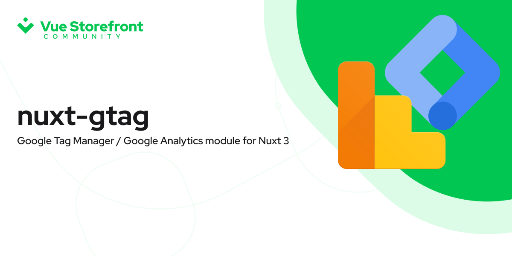

<br />
<p align="center">
  
</p>

<h1 align="center">
  nuxt-gtag
</h1>
<p align="center">
   Welcome to the nuxt-gtag Nuxt 3 module.
</p>

<p align="center">
  <a href="https://github.com/vuestorefront/vue-storefront/">
    
  </a>
    <a href="https://twitter.com/vuestorefront">
        
    </a>
    <a href="https://www.youtube.com/c/VueStorefront">
        
    </a>
    <a href="https://discord.vuestorefront.io/">
        
    </a>
</p>
<p align="center">
    <a href="http://commitizen.github.io/cz-cli/">
        
    </a>
    <a href="https://github.com/vuestorefront-community/nuxt-gtag">
        
    </a>
    <a href="https://github.com/vuestorefront-community/nuxt-gtag/pulls">
        
    </a>
</p>
<p align="center">
<a href="https://stackblitz.com/github/vuestorefront-community/nuxt-gtag"></a>

</p>

> # #TechForUkraine
> <div align="center">
>   <p>
>      
>   </p>
>   <h2><strong>Russia’s military aggression against Ukraine.</strong></h2>
>   <div align="left">
>     <h3>How can you support Ukrainian civil society?</h3>
>     All help is needed. If you are not able to help locally, by sheltering a fellow Ukrainian, you can also:
>     <ul>
>       <li>
>           Support the Ukraine Armed forces directly by sending funding to the special accounts.<br />
>           <a href="https://bank.gov.ua/en/news/all/natsionalniy-bank-vidkriv-spetsrahunok-dlya-zboru-koshtiv-na-potrebi-armiyi"
>               target="_blank">NBU Special Account to Raise Funds for Ukraine’s Armed Forces</a>
>       </li>
>       <li>
>           Help the ICRC (Red Cross) with donations.<br />
>           <a href="https://www.icrc.org/en/where-we-work/europe-central-asia/ukraine" target="_blank">Ukrainian
>               Red Cross Society</a>
>       </li>
>       <li>
>           Donate to the United Help Ukraine.<br />
>           <a href="https://unitedhelpukraine.org/" target="_blank">United Help Ukraine</a>
>       </li>
>       <li>
>           Donate to Voices of Children<br />
>           <a href="https://voices.org.ua/en/" target="_blank">Voices of Children</a>
>       </li>
>   </div>
> </div>

## Setup

1. Add `@vue-storefront/nuxt-gtag` dependency to your project

```bash
yarn add @vue-storefront/nuxt-gtag # or npm install @vue-storefront/nuxt-gtag
```

2. Add `@vue-storefront/nuxt-gtag` to the `modules` section of `nuxt.config.js`

```typescript
export default {
  modules: [
    // Simple usage
    '@vue-storefront/nuxt-gtag',

    // With options
    ['@vue-storefront/nuxt-gtag', { /* module options */ }]
  ]
}
```

### Using top level options

```typescript
export default {
  modules: [
    '@vue-storefront/nuxt-gtag'
  ],
  gTag: {
    /* module options */
  }
}
```

## Module Options

```typescript
export type Options = Partial<{
  bootstrap: boolean;
  config: Partial<{
    id: string;
    params:
      | {
        eventCallback: () => void;
        eventTimeout: number;
        groups: string | string[];
        sendTo: string | string[];
      }
      | Record<string, unknown>;
  }>;
  customPreConnectOrigin: string;
  customResourceURL: string;
  debug: boolean;
  defaultGroupName: string;
  deferScriptLoad: boolean;
  disableScriptLoad: boolean;
  enabled: boolean;
  dataLayerName: string;
  includes: Partial<{
    id: string;
    params:
      | {
        eventCallback: () => void;
        eventTimeout: number;
        groups: string | string[];
        sendTo: string | string[];
      }
      | Record<string, unknown>;
  }>[];
  onAfterTrack: (
    to: VueRouter.RouteLocationNormalized,
    from: VueRouter.RouteLocationNormalized,
  ) => undefined;
  onBeforeTrack: (
    to: VueRouter.RouteLocationNormalized,
    from: VueRouter.RouteLocationNormalized,
  ) => undefined;
  pageViewExcludedRoutes: Array<
    | Record<string, unknown>
    | string
    | Partial<{
        path: string;
        name: string;
        [key: string]: unknown;
      }>
    | VueRouter.RouteLocationNormalized>;
  pageViewPrependBase: boolean;
  pageViewScreenViewEnabled: boolean;
  pageViewSkipSamePath: boolean;
  pageViewTemplate: (
    to: VueRouter.RouteLocationNormalized,
    from?: VueRouter.RouteLocationNormalized,
  ) => VueRouter.RouteLocationNormalized;
  pageViewTracker: boolean;
  pageViewUseFullPath: boolean;
}>;
```

## Contributing

<p align="center">
<a href="https://stackblitz.com/github/vuestorefront/developer.vuestorefront.io"></a>

</p>

If you like the ideas behind Vue Storefront and want to become a contributor - join
our [Discord server](https://discord.vuestorefront.io/), check
the [list of the active issues](https://github.com/vuestorefront-community/nuxt-gtag/issues) or contact us directly via
contributors(at)vuestorefront(dot)io.

If you have discovered a 🐜 or have feature suggestion, feel free
to [create an issue](https://github.com/vuestorefront-community/nuxt-gtag/issues/new/choose) on GitHub.

## Support us

**Vue Storefront is and always will be Open Source, released under MIT Licence.**

You can support us in various ways:

- **Contribute** - this is how the Core Team is supporting the project!
- **Evangelize** - tweet about us, take some speaking slot at a tech conference, etc.

## Partners

Vue Storefront is a Community effort brought to You by our great Core Team and supported by the following companies.

[**See Vue Storefront partners
directory**](https://www.vuestorefront.io/partner-agencies?utm_source=github.com&utm_medium=referral&utm_campaign=readme)

Vue Storefront source code is completely free and released under
the [MIT License](https://github.com/vuestorefront/vue-storefront/blob/master/LICENSE).


[nuxt]: https://v3.nuxtjs.org/